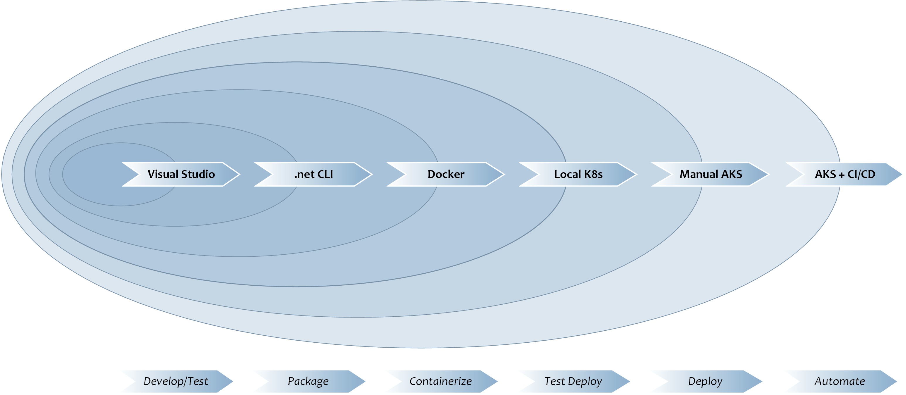
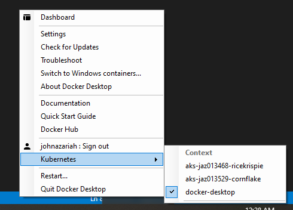

# The Development/Deployment Workflow

## Multiple Stages In The Development Workflow
You can think of the process of developing and deploying an Orleans application as a journey, as indicated by the following diagram.

As seen above, you might expect to go through the following stages whilst building an application: 

## 0. Initialization

As soon as you create a project from the template, run `make init` in the project folder. This will create a git repository in your project folder and make the initial commit. 

Follow git practices to create branches and commit code. You can use appropriate `git remote` commands to link your repository with something hosted on [GitHub](https://github.com/). We'll be primarily developing scripts for CI/CD on GitHub.

## 1. Application Development/Testing 
We are assuming that most of your code will be developed with **Visual Studio** (or **Visual Studio Code**).

Here you will add grain definitions corresponding to the domain of your problem, the 
appropriate business logic, and the associated tests to validate that your grains are processing their messages correctly.

You can find further details about how to develop an Orleans application in the sections on [Grain Development](grain-development.md), [Grain Testing](grain-testing.md) and [Debugging](grain-debugging.md).

In this stage, you can expect to take advantage of all the tooling available to general .NET applications such as debugging with breakpoints, inspection of variables and so on.

The purpose of this framework is to allow you to focus most of your time here, as this is the unique part of your application. The rest of the boilerplate and automatable processes can come from the framework.

Once you are comfortable with the functionality of your application, you will begin the next stage.

## 2. Standalone Mode and Packaging
The second stage will be to validate that the application will run in 'standalone' mode with the **dotnet** CLI. 

In this stage, you will primarily use the `git bash` shell and use `make` to run commands.

The primary purpose of ensuring that your application can run with the dotnet CLI is to ensure that you can run in a server environment, where Visual Studio will not exist. This is achieved by ensuring that the artefacts produced by `dotnet publish` are sufficient to successfully run the application.

Most of the time you will spend here is ensuring that dependencies and configurations are set up in a portable way, and that the excellent support Visual Studio gave you whilst developing and debugging the application does not turn into a hidden dependency for your server version.

1. Clean the project with `make dotnet-clean`. This removes build artefacts and restores
1. Restore, Build and Test the project with `make dotnet-test`.
1. Publish the project to an output folder with `make dotnet-publish`.
1. Run the artefacts in the output folder with `make dotnet-run`.

- `make dotnet-all` is an alias target which does `dotnet-clean dotnet-test dotnet-publish dotnet-run`. This will implicitly rebuild, test, republish and run the project as you make changes in your code and re-run it.

Once the application can run from the dotnet CLI, we are able to package and deploy single instances of the application into Azure (or indeed AWS) in a variety of configurations. On Azure, there are several references on how to deploy an App Service, for example, or set up a VMSS with your application so you can scale to a cluster with multiple silos. 

However, because this is an opinionated framework, the next stage in the journey will involve _containerization_.

## 3. Containerization

The third stage will be to containerize the application so we can use **Docker**.

This framework has the strongly held opinion that building and running your application from within Docker has the effect of exorcising it from a host of gremlins that pop up during running in production.

We hold that **Docker** has _at least_ the following benefits:
- Building the application inside of a Dockerfile strictly constrains the build environment, eliminating the effects of environmental dependencies and tool version combinations.
- Building a dotnet application inside of a Dockerfile makes it truly cross-platform. This means that even though we run Docker on a Windows machine to build the image, we can build an image that will run correctly on Docker running on Linux in production.
- Repeatability. You are sure that the same docker container deployed a second time months later than the first will result in the exact same runtime image. This means that roll-back becomes much easier.

The template includes a built-in `Dockerfile` script to build and package the application.

1. Build the `docker` image with `make docker-build`. This will start with a pristine development environment, build & test the project, publish the build artifacts, and copy them onto a pristine runtime environment. Intermediate build artefacts and tools are therefore not present in the runtime image.

    For the `silo-and-client` template type, these targets will build _both_ the silo and client images.

1. Run the image locally with `make docker-run`. The default `Dockerfile` is set to run a single-silo cluster with `HostLocal` clustering. If you want to run with `Azure` clustering mode against your local Azure Storage Emulator, you can use `make docker-run-local-ase`.
    
    For the `silo-and-client` template type, these targets will run _both_ the silo and client images. You may need to tweak the arguments passed to the client image to properly identify and communicate with the silo by modifying the `silo_address` argument in the client's `Makefile`.

1. Stop all running containers - not just your Orleans Universal Silo ones - by using `make docker-stop`. 

1. List the docker images you have built with `make docker-list`. You will note that the tag of the image is based on your **git branch** and **git commit hash**. Ensure that you commit your changes before building a docker image to be able to tell, at a glance, what code is present in which docker image.

## 4. Test Multi-Instance Deployment

Whilst the prior stages of our journey allowed us to run single-instances of our application, this stage in our journey kicks it up a notch and runs a multi-instance cluster within the local Kubernetes platform enabled with your Docker Deskop version.

_For a lot of developers who are not familiar with Kubernetes, this stage is the first step into a steeper learning path. So don't feel discouraged if you do not get things to click immediately. I spent a lot of time reading and trying things out while developing applications at this stage._

_I am assuming you have built your development environment as I've suggested, so the following instructions are geared specifically for such a setup. If your environment is different, try analogous steps or reach out for help on twitter/github!_

1. Get familiar with the idea of Kubernetes (k8s) contexts as you proceed. You will be using the _same_ `make k8s-xxx` targets against both your local k8s environment (in this stage) and the remote AKS environment (in the next stage). 

    On Windows, you can visually inspect which context you are operating against by clicking on the "Docker whale" in the tray, and looking for the context in the "Kubernetes" menu item.
    

    For this stage, ensure that you have selected the `docker-desktop` context.

1. Deploy the most current image (based on the **git branch name** and **git commit hash**) to the k8s context by running `make k8s-deploy`. This will create a namespace (by default named 'green'), and deploy k8s `service`s and `pod`s into it.

    The development cycle you will likely follow at this stage is:
    - make some changes to your code
    - `make dotnet-all` to build, test and run your project until satisfactory.
    - commit (to update the hash of the HEAD commit)
    - `make docker-build` to build a `docker` image with these changes.
    - `make k8s-deploy` or `make k8s-upgrade` to deploy 3 copies of the latest image into the current `k8s` context. 

1. You can delete an existing namespace in the current k8s context with `make k8s-cleanup`. This will blow away all your pods.

    You may not need to do this the first time, but it's recommended that you do this after making many changes so you can verify your application running in a clean-slate environment. After running `make k8s-cleanup`, you will need to run `make k8s-deploy` as this will create a new namespace. 

    Kubernetes sometimes takes time to delete a namespace, so ensure you wait appropriately before re-creating a new namespace with the same name as one you just deleted.

1. You can keep the namespace and existing k8s `service`s, and simply upgrade the `pod`s with the latest image with `make k8s-upgrade`.

1. You can use `make k8s-status` as an alias for `kubectl get all` to inspect all the components running in the current context.

        Digression : Docker Compose 

        We can get also get multiple instances - for testing purposes - of our docker image running and cooperating with **Docker Compose**.

        There is no default `make` target for running `docker compose`, but you can write one, or just do `docker compose up` to get 3 instances pop up. 
        
        This is useful to try if the local k8s cluster doesn't work, and you want to make sure it's not something to with your image!

## 5. Manual Deployment to AKS

_For a lot of developers who are not familiar with Azure, this stage can feel daunting so don't feel discouraged if you do not get things to click immediately. I spent a lot of time reading and trying things out while developing applications at this stage._

_I am assuming you have built your development environment as I've suggested, so the following instructions are geared specifically for such a setup. If your environment is different, try analogous steps or reach out for help on twitter/github!_

I am also assuming you have at least one Azure subscription set up properly. Sign up for a [free Azure subscription](https://azure.microsoft.com/en-us/free/search/) if you do not.

For this stage, it's best to create two terminals running `git bash` and set the working directory of both of them to the project folder.

For purposes of clarity, we'll call one of them the "Azure" shell, and the other the "Project" shell:

1. In the "Azure" shell:
    1. Run `make az-start` to fire up an interactive shell inside the official Azure CLI Docker image, mounting the project directory and making it current.
    
        This will allow us to run `az ...` commands without installing the `AZ CLI`, as well as targets from the `Makefile`.
    
    1. Run `make az-login`. This will allow you to use your browser to authenticate against Azure. When this succeeds, it will print out all the subscriptions you have access to. Find the `id` property of the one you want to use.
    
    1. Run `make az-sub-set sub=<id you selected above>`. This will set the shell to use the selected subscription by default, and all further operations will affect that subscription. `make az-sub-show` will show the active subscription details.

    1. First-Time Operations:

        This would be a good time to edit `Setup.cfg` and provide values in it for your subscription, your organization name, the project name, and the region you want to use. The organization name has to result in a globally unique Azure Container Registry name, and should only contain lower-case alphanumerics. A good organization name is a representative prefix of a few characters followed by a random number of 5 or 6 digits.

        If you have created and deployed a project before, put the same organization name as before into `Setup.cfg`.

        If you have created and deployed a project before, ensure that the project name in `Setup.cfg` is new and unique.

        **Remember that the `Setup.cfg` file contains secrets, so we DO NOT include it in source control**.

        - `make az-new-org` should only be run _once per organization name_. 
        
            It sets up a resource group and an Azure Container Registry that can be shared against many projects.
            
            Additional project-shareable resources like an Analytics Workspace are also set up here. 

        - `make az-new-proj` should only be run _once per project_. 
            It sets up a resource group, an AKS cluster, and a storage account for use _only_ by this project.
            
            When this target is run, the script will emit two values:

            1. A storage connection string. Put this value _carefully_ as the value of `paks_storage_connection_string` in `Setup.cfg`.
            1. A token to be used to login to the Azure Container Registery. Put this value _carefully_ as the value of `oaks_acr_login_token` in `Setup.cfg`. This is a _long_ string with no line breaks.

1. In the "Project" shell:

    1. Run `make aks-prepare` to set up the k8s context to the remote AKS cluster. It will: 
        - `docker login` into the ACR using the login token embedded in `Setup.cfg` so that deployments can pull the images from the ACR.
        - switch the context on your local kubernetes environment to point to the newly created AKS cluster
        - create a namespace on the AKS cluster
        - set up the storage connection string as a `kubectl secret` so that deployments can properly configure the silos to use Azure Storage for Clustering and Persistence

    1. Run `make docker-push` to push the latest built image to the remote Azure Container Registry.

    1. Run `make k8s-deploy` to deploy the remote AKS cluster, where it will pull the image from the Azure Container Registry specified, and use the secret setup to interact with Azure Storage. 

## 6. CI/CD and more
Stay tuned for this.
